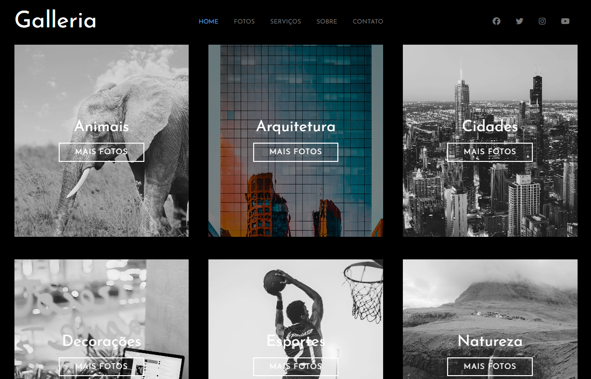

# Página Galeria

Projeto desenvolvido com HTML, CSS e o pré-processador SASS. Tem como objetivo integrar os recursos do SASS a um projeto CSS, buscando um processo mais eficiente na escrita com o uso de variáveis e mixins. O projeto tem como principal recurso a interação do mouse com os cards da galeria.

